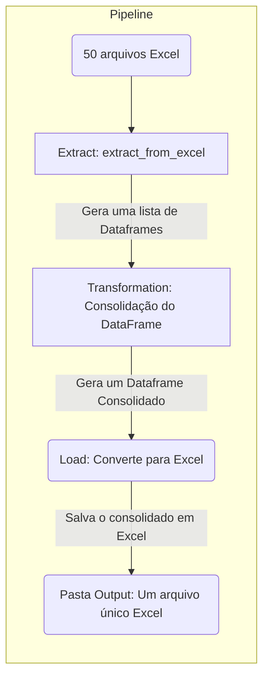

# Bem vinda(o) ao projeto de ETL

Para a documentação completa, visite [Meu Projeto](https://Brunocodigoestudo.github.io/estrutura_projeto_ETL/).

## Workflow

# Função de EXTRAÇÃO de dados

### ::: app.pipeline.extract.extract_from_excel

# Função de TRANSFORMAÇÃO de dados

### ::: app.pipeline.transform.concat_data_frames

# Função de LOAD(CARGA NOS DADOS) de dados

### ::: app.pipeline.load.load_excel

